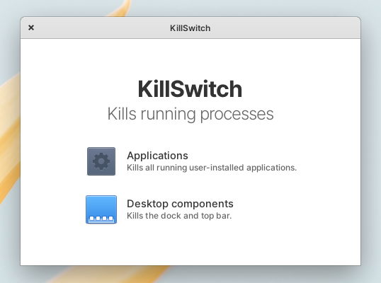

# KillSwitch

Kills all applications. An attempt at making a simple app in Python in one file. Requires Gtk3 and Granite.

## Running

Requires Python3. Run with `python3 KillSwitch` or set as executable and run via

```bash
chmod +x KillSwitch
./KillSwitch
```

## Installing with AppEditor

Recommended:

1. Install [AppEditor](https://github.com/donadigo/appeditor)
2. Download KillSwitch (recommended to store somewhere where it won't be accidentally deleted, i.e. in `~/Scripts` for instance).
3. Right click on KillSwitch and select "Create a Menu Entry".
4. Configure it however you want.

Manual:

1. Download KillSwitch (recommended to store somewhere where it won't be accidentally deleted, i.e. in `~/Scripts` for instance).
2. Create a `com.github.pongloongyeat.killswitch.desktop` file in `~/<username>/.local/share/applications`.
3. Edit the newly created desktop file with

```
[Desktop Entry]
Type=Application
Name[en_US]=KillSwitch
Exec=/path/to/KillSwitch
```
